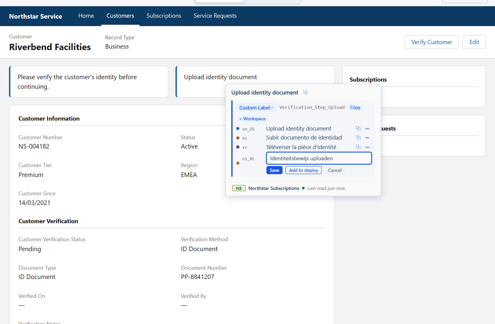

<h1 align="center">Sextant</h1>

See what your Salesforce org actually says. A Chrome extension for Salesforce admins and developers.

**Sextant — Salesforce Metadata & Translations** identifies the Salesforce metadata behind the text on a Lightning page and shows its translations in every language the org has. Hover any text in Salesforce Lightning and Sextant tells you what it is — the field, picklist value, Custom Label or object behind it — with its API name and every translation, editable in place. Then it keeps track: what changed, who changed it when that is known, and whether it reached every org.

<a href="https://usesextant.dev/demo/?scenario=hover"><picture><source media="(prefers-color-scheme: dark)" srcset="assets/sextant-hover-dark.png"></picture></a>

Hold a key, point at any text on the page: Sextant says what it is, and you fix it there. The real product, photographed in the demo. Northstar Subscriptions does not exist.

There is no server, no account and no telemetry. Sextant works with the Salesforce session you already have and keeps what it keeps in your browser profile.

**Try it without installing anything:** [the interactive demo](https://usesextant.dev/demo/) runs the real Sextant interface and background process in your browser, against Northstar, a fictional Salesforce org. Nothing is sent anywhere. [How the demo works](https://usesextant.dev/demo/how-it-works/).

**Install:** not on the Chrome Web Store yet. When it is, the link will appear here, on the website and in the release notes — from one setting, so they cannot disagree. Nothing in this repository is meant to be installed by hand.

**Website:** https://usesextant.dev · [Product](https://usesextant.dev/features/) · [Guides](https://usesextant.dev/guides/) · [Trust Center](https://usesextant.dev/trust/) · [Changelog](https://usesextant.dev/changelog/)

## What it does

- **Inspect** — hold a key and hover any label, field, button or picklist value: what it is, its API name, every language your org has configured, and whether a translation is missing or identical to the source. One answer, or an honest *Unknown origin* — never a ranked list of guesses.
- **Edit where you found it** — Custom Labels, custom (`__c`) fields and custom picklist values, plus record types, custom buttons and links, quick actions, layout sections, custom tabs and apps, with every save re-reading the org's current value first. Standard fields and standard picklist values are deliberately read-only.
- **Translate All** — annotate every translatable element on the page at once, filter to what is missing, and step through the issues.
- **Search** — from a translated string back to the component it belongs to, across the org's metadata.
- **Workspace** — every edit captured automatically, with before/after history and a `package.xml` ready to deploy.
- **Activity and comparisons** — what happened in the org from evidence rather than inference, which deployments landed, and the same component across several orgs, or across two reads of the same org.

Start somewhere specific in the demo:

- [Inspect a label on a Salesforce record page](https://usesextant.dev/demo/?scenario=hover)
- [Translate All: mark every translation on the page](https://usesextant.dev/demo/?scenario=translate-all)
- [Search across the org's metadata](https://usesextant.dev/demo/?scenario=search)
- [A Custom Label in the inspector](https://usesextant.dev/demo/?scenario=inspector)
- [Activity: what changed, and who changed it](https://usesextant.dev/demo/?scenario=activity)
- [Translate the components you are working on](https://usesextant.dev/demo/?scenario=translations)
- [Compare translations between Production and UAT](https://usesextant.dev/demo/?scenario=multi-org)
- [Create Custom Labels with their translations](https://usesextant.dev/demo/?scenario=create-labels)
- [Settings](https://usesextant.dev/demo/?scenario=settings)

## Why Sextant exists

A user reports that a field shows the wrong text in French. Twenty minutes later you are still in Setup, working out whether the string you are looking at is a Custom Label, a field label, a picklist value or a Translation Workbench override — and which of the four places it can be edited from. Salesforce renders text; it does not tell you where the text came from. Sextant answers that by hovering over the string, and it edits the answer where you found it.

## What this repository is

Sextant's public home: the place to read what the product is, how it treats your data, how a release is built and checked, and what changed in each version — and the place to report a bug or ask for something.

The source code is not published here, and this repository does not pretend otherwise: whether and under what terms it will be is a decision that has not been made yet. Everything here is generated from the product's own sources and versioned with it.

| I want to… | Go to |
|---|---|
| understand what Sextant does | [the product page](https://usesextant.dev/features/) |
| try it | [the interactive demo](https://usesextant.dev/demo/) |
| learn how Salesforce translation works, with or without Sextant | [the guides](https://usesextant.dev/guides/) |
| read what it stores, sends and asks for | [PRIVACY.md](PRIVACY.md) · [DATA_HANDLING.md](DATA_HANDLING.md) · [PERMISSIONS.md](PERMISSIONS.md) |
| see how a release is built and verified | [RELEASE_SECURITY.md](RELEASE_SECURITY.md) · [releases/](releases/) |
| see what the design defends against | [THREAT_MODEL.md](THREAT_MODEL.md) |
| report a security problem | [SECURITY.md](SECURITY.md) — never in a public issue |
| report a bug or request a feature | [SUPPORT.md](SUPPORT.md) |
| see what changed | [CHANGELOG.md](CHANGELOG.md) |

## Privacy, in one paragraph

Sextant sends requests only to Salesforce, and the browser blocks its pages from contacting any other site. There is no analytics, telemetry, crash reporting or advertising; no Sextant account or server; nothing downloaded and run. Your Salesforce session is read when a request needs it and is never stored, logged or exported. What Sextant keeps stays in your browser profile, where you can see, export and delete it. Each of those sentences is enforced by the browser, checked by tests or checked on every release build — [DATA_HANDLING.md](DATA_HANDLING.md) says which, and what each one does not mean.

## Releases

Every published version has a directory under [releases/](releases/) with the notes people read, the SHA-256 of every file in the package, a software bill of materials, the permission and network diff against the previous version, and the record of how it was built. [RELEASE_SECURITY.md](RELEASE_SECURITY.md) explains what a hash proves and what it does not.

- **1.0.0** — 2026-09-28 — [what changed](releases/1.0.0/RELEASE.md) · [evidence](releases/1.0.0/)

## Support and feedback

Support: support@usesextant.dev. Bug reports and feature requests are welcome as issues — [SUPPORT.md](SUPPORT.md) says what helps and, more importantly, what never to paste: session ids, org ids, real metadata or screenshots of a live org. Security problems go through [SECURITY.md](SECURITY.md), never a public issue.

---

Sextant is an independent product. It is not made, endorsed or supported by Salesforce, Inc. Salesforce and Lightning are trademarks of Salesforce, Inc., used only to describe what Sextant works with. Made and published by Manuel Roldán Pérez. Version 1.0.0 (not on the Chrome Web Store yet).
