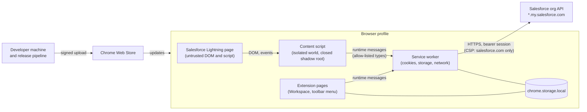

# Sextant threat model

**Version 1 · 2026-09-15** (`DECISIONS.md #320`, `ROADMAP.md` `P46-TM1` … `P46-TM5`)

What Sextant protects, from whom, how, how each protection is known to work, and what remains. Every
mitigation names the file or test that holds it; a mitigation without one is marked as a process or an
open item, never presented as a control. The findings of the audit that produced this document are in
`AUDIT_2026-09-15.md`.

---

## 1. What is worth attacking

| Asset | Why it matters |
|---|---|
| **The Salesforce session** (`sid` cookie) | A bearer credential for the user's org: whoever holds it acts as that user until it expires. The most valuable thing Sextant touches. |
| **The ability to write to an org** | Sextant can change translations and deploy metadata as the user. Used against the user's intent, it changes a production org. |
| **Org content in local storage** | Metadata, translations, names of users, deployment records, history — per org, in `chrome.storage.local`. |
| **The update channel** | Whoever can publish a Sextant version runs code with Sextant's permissions on every installed browser. |
| **The release inputs** | Source, lockfile, dependencies, the build machine, the store account. |
| **The user's trust in what Sextant says about itself** | A false privacy statement is a harm even when no data is lost. |

## 2. Trust boundaries

The boundaries that matter most:

1. **Page → content script.** Everything a Salesforce page renders, including text an attacker may control
   (a record name, a label value, a component's markup), reaches the content script.
2. **Content script → service worker.** The content script is the one privileged component exposed to
   page-controlled input; the worker holds the session, the storage and the network.
3. **Service worker → the network.** The only place data leaves the browser.
4. **Developer → store → every user.** An update runs with Sextant's permissions everywhere.

## 3. Adversaries

| Id | Adversary | Can | Cannot (by assumption) |
|---|---|---|---|
| A1 | **Hostile content in a Salesforce page** — a user or integration that controls record data, labels, component markup or a custom component's script | Put arbitrary text and markup in front of the content script; dispatch DOM events; run script in the page's own world | Read the content script's isolated world or a closed shadow root; call extension APIs |
| A2 | **A hostile website** (not Salesforce) | Everything any web page can do | Message Sextant (no `externally_connectable`); get the content script injected (Lightning only) |
| A3 | **Another installed extension** | Its own permissions | Reach Sextant's handlers: Sextant registers no external message listener |
| A4 | **A hostile file** the user imports | Arbitrary JSON of any size | — |
| A5 | **A compromised dependency** | Code at install time (scripts) or in the bundle | Pass the release gates unnoticed if it adds a destination, telemetry or an install script (§4, T8) |
| A6 | **A compromised publisher account or build machine** | Publish any package to every user | — this is the one the product cannot defend against by itself (T9) |
| A7 | **Someone with the user's browser profile or computer** | Read local storage and the live session | — out of scope for technical controls (T14) |
| A8 | **The user, making a mistake** | Deploy to the wrong org or to production | — the design helps here (T13) |

Out of scope: vulnerabilities in Salesforce, in the browser, or in the operating system; network attackers
against TLS; Salesforce administrators acting within their own org.

## 4. Threats, mitigations, evidence, residual risk

Evidence key: **E** enforced by the browser or platform · **T** automated test · **B** release build check ·
**P** process (a human step) · **O** open.

### T1 — The session is sent somewhere other than the user's org

- **Mitigations.** CSP `connect-src 'self' https://*.my.salesforce.com` on every production build (narrowed from
  `*.salesforce.com` with the host permission by `#392`)
  (`manifest.config.ts`) — **E**, verified in a real browser against the built extension, with a positive
  control (`security-qa/csp-enforcement.pw.ts`). One transport performs every request and validates the
  destination with a real URL parser, refusing userinfo, ports, lookalike suffixes and non-HTTPS
  (`src/shared/salesforce-transport.ts`, `salesforce-origin.ts`; `src/shared/salesforce-origin.test.ts`) — **T**.
  No other module calls a request primitive (`src/security/network-boundary.test.ts`) — **T**. The release
  scan fails on any unapproved URL origin in the bundle (`scripts/release/scan-dist.mjs`) — **B**.
- **Residual.** The CSP allows any host under `my.salesforce.com`, not only the user's org — and that includes
  orgs anyone can register (a free Developer Edition org); the per-org rule is enforced by code and tests, not by
  the browser. (`#392` took Salesforce's other hosts, including its unauthenticated intake hosts, out of the policy.) The CSP governs *connections*
  only: opening a tab, a DNS hint (`dns-prefetch`, `preconnect`) or a meta refresh could carry data
  out without a `fetch`. Nothing in the product uses those primitives outside `safe-navigation.ts`
  (`src/security/navigation-boundary.test.ts`) — **T** — and the release scan fails the package on any
  of them the product never uses and reports where it opens tabs (`scripts/release/scan-dist.mjs`) —
  **B**. Both hold for the product's own code; against a compromised dependency (T8) or publisher (T9)
  they detect rather than prevent.

### T2 — The session leaks through logs, storage, messages or exports

- **Mitigations.** Read per request, returned to the caller, never written (`getSessionId` in
  `src/background/index.ts`). Static and runtime checks that the value never reaches a console line, the
  storage bucket, a message reply or a request to another host (`src/security/session-boundary.test.ts`) —
  **T**. Diagnostics are opt-in and redact credential shapes (`src/shared/diagnostics.ts`,
  `secret-redaction.ts`); exports redact and withhold credentials (`local-data.ts`) — **T**. The release
  scan fails on a session-shaped string in the bundle — **B**.
- **Residual.** A Salesforce error body echoed into a console warning is not redacted in the live console
  (it is not persisted).

### T3 — Page-controlled input makes the worker act for someone else (confused deputy)

- **Mitigations.** Every message is classified by sender before dispatch
  (`src/shared/message-guard.ts`): content scripts are limited to ten message types the in-page UI needs,
  must come from a Lightning origin, and must carry origins that match their sender where they name one;
  sizes are bounded. Deletion, settings, org switching and every other type are extension-page only.
  Refusals are silent to the sender and counted (`src/security/message-boundary.test.ts`, including a
  hostile content-script context against the real worker) — **T**.
- **Residual.** A content script context taken over by A1 (its *isolated world*, which page script cannot
  reach; a browser or extension defect would be needed) can still ask for what the tooltip can do —
  including queuing an edit and saving a translation. The production and unidentified-org confirmation
  (T13) is asked *by the content script itself*, so it does not bind a context that has been taken over;
  and Chrome grants such a context the same `chrome.storage` access the worker has, so the message
  policy bounds what the worker will *do*, not what the store holds. Page script in its own world gets
  none of this: the hotkey handlers ignore synthetic keyboard events (`isTrusted`, `#323`), and the
  tooltip's controls live inside a closed shadow root it cannot target.

### T4 — Org content becomes script in an extension page or an exported report

- **Mitigations.** React rendering only; no `dangerouslySetInnerHTML`, `innerHTML` assignment, `eval`,
  `Function` or string timers (`src/security/code-boundary.test.ts`) — **T**. Extension pages run under the
  CSP (`script-src 'self'`, no inline script) — **E**. The exported HTML report escapes every
  interpolated value and carries its own restrictive CSP (`src/shared/conformance-export.ts`) — **T**.
- **Residual.** None known.

### T5 — A URL built from org data navigates somewhere dangerous

- **Mitigations.** Every navigation sink goes through `src/shared/safe-navigation.ts`, which accepts only
  HTTPS Salesforce URLs or the extension's own pages; `javascript:`, `data:` and lookalike hosts are refused
  (`src/security/navigation-boundary.test.ts`) — **T**.
- **Residual.** None known.

### T6 — The page interferes with Sextant's UI

- **Mitigations.** The tooltip renders in a closed shadow root (`src/content/index.tsx`), so page script and
  styles cannot read or restyle it; the content script runs only on `*.lightning.force.com`.
- **Residual.** A page can obscure or overlay Sextant's UI, and can detect that Sextant is installed by
  loading its web-accessible chunks (`use_dynamic_url: false`, generated by the build tool) — **O**, owner
  decision.

### T7 — A hostile import file

- **Mitigations.** Size cap before reading, prototype-polluting keys refused, per-org partitions validated
  as org ids, null-prototype containers (`src/shared/import-safety.ts` and its callers) — **T**.
- **Residual.** An import from a trusted-looking file still replaces what the user chose to replace.

### T8 — A compromised dependency

- **Mitigations.** Lockfile committed; install scripts run only for reviewed packages
  (`.npmrc` `strict-allow-scripts`, `package.json` `allowScripts`) — **E/P**. The release build records
  exactly which packages reach the bundle (12 today) with lockfile integrity, produces a CycloneDX SBOM, and
  classifies any change to bundled packages, destinations or install scripts as security-sensitive,
  requiring explicit approval (`scripts/release/release.mjs`) — **B/P**. The artifact scan catches new
  destinations, telemetry, remote code and secrets whatever their source — **B**.
- **Residual.** Malicious behaviour inside an already-approved package version, which adds no destination,
  is not detectable by these checks. Several development-only packages have known advisories
  (`AUDIT_2026-09-15.md`).

### T9 — A malicious update

- **Mitigations.** One canonical release path from a tagged commit in a clean checkout, with every gate
  above; published hashes and provenance; release classification with human approval for trust changes
  (`RELEASE_SECURITY.md`) — **B/P**. Publisher account hardening (hardware security keys, no shared
  credentials) — **P**, checklist in `RELEASE_SECURITY.md` §2.
- **Residual.** **The Chrome Web Store accepts any package from the publisher account.** Someone who holds
  that account bypasses every gate in this repository, and browsers install the update automatically. The
  controls reduce the chance of that and make it detectable afterwards; they cannot prevent it.

### T10 — Remote or string-evaluated code

- **Mitigations.** Manifest V3 forbids remote code for extension pages and workers; the CSP forbids
  `eval` — **E**, verified in the browser suite. Source guards and the artifact scan — **T/B**.
- **Residual.** None known.

### T11 — A new destination or telemetry added by accident

- **Mitigations.** T1's CSP and tests; the approved baseline of origins, permissions and CSP
  (`release-metadata/trust-baseline.json`); a trust diff on every release — **E/T/B**. Changing any of it is
  a Trust Architecture Change (`RELEASE_SECURITY.md` §4) — **P**.

### T12 — The development server exposes source or org data

- **Mitigations.** Development servers refuse the editor-launch route and deny serving environment files,
  keys and `*.gate.json` evaluation files (`scripts/dev-server-hardening.ts`) — verified with requests.
- **Residual.** Development servers still serve source to the local machine, by design.

### T13 — A write lands in the wrong org or in production by mistake

- **Mitigations.** Org resolved per request and shown in every confirmation (name, environment, host); a
  direct save to a production org or to an org Sextant cannot identify always asks and cannot be silenced
  (`src/shared/direct-deploy.ts`; `src/workspace/confirm-deploy-production.test.tsx`,
  `src/content/tooltip-confirm.test.tsx`) — **T**. Optimistic concurrency refuses to overwrite a newer value.
- **Residual.** Batches assembled in the deploy tray are sent on the tray's Deploy button after its own
  review, without the per-change dialog.

### T14 — Someone with the browser profile reads local data

- **Mitigations.** None technical, stated plainly (`SECURITY.md` §5). No credential is stored; data is
  visible and deletable per org and in full.
- **Residual.** Accepted.

### T14b — A second Salesforce principal in the same browser profile reads the first one's data

Distinct from T14, and **not** accepted the same way. T14 is about someone with the machine; this is
about two legitimate Salesforce identities that the browser, and therefore Sextant, sees as one context:
two users sharing a profile, an admin who signs out and back in as a restricted test user, or a private
window signed in to the same org as somebody else — and about ONE identity whose permissions shrink.
Sextant reads with the current session and stores what comes back, so without a principal in the picture
the store is shared between them. The rule it is held to: **Sextant never expands the visibility
Salesforce grants to the current context** (`DECISIONS.md #338`).

An earlier version of this section recorded the stored payload as OPEN. It was worse than it said: the
"current principal" every comparison used was a value restored from disk — whoever signed in LAST — so an
administrator's index was adopted for whoever was actually there on every worker start, and every store
written before attribution existed matched everybody. That is closed as follows.

- **Mitigations.**
  - **Who is signed in is proven, never remembered.** Before anything stored for an org is served, used
    or added to, the worker asks Salesforce whose session the org's cookie is (`getUserInfo()`, which
    needs no permission). The proof lives in the worker's memory only, is void the moment that cookie
    changes (`chrome.cookies.onChanged`, plus a re-read of the cookie at every entry point, because a
    worker that was asleep never sees the event) and is earned again at every worker start. The session is
    still stored nowhere (`src/background/reader-proof.ts`; `reader-proof.test.ts`) — **T**.
  - **An org's stored data belongs to one proven principal at a time.** When a different principal is
    proven for an org, everything Salesforce-derived that is stored for it — index, component list,
    capabilities, read status, Activity history and baselines, snapshots, deployments and their
    manifests, the Workspace, recents, marked actors, detection traces — is set aside under the previous
    principal's id *before anything is served or read*, and the newcomer's own (or nothing) takes its
    place. Nobody inherits in either direction. The move is crash-safe: an intent is written first, the
    org answers nobody while one exists, and every step is idempotent, tested at each interruption point
    (`src/shared/reader-scope.ts`, `src/background/reader-vault.ts`; `reader-vault.test.ts`) — **T**.
  - **One gate, closed by default.** Data is served only while the org's owner is the principal proven
    now and nothing is being moved: signed out, not confirmed, somebody else's, mid-move and
    unattributable are all closed, and a closed gate needs no network and no re-read to be closed — the
    safe state exists before any new read completes. Every message the worker handles declares whose org
    it is about, and the reader is established before its handler runs (`src/shared/reader-policy.ts`);
    every operation that talks to Salesforce takes its session through the same step; a read that was in
    flight when the principal changed is discarded rather than filed under whoever is there now; the
    in-memory index names its principal and is dropped on the change. The fourteen scenarios — admin then
    restricted user, and back; no cookie event; worker restart; interrupted move; several orgs; Search
    and Quick Search; Activity; an upgrade — run against the real worker
    (`src/background/reader-isolation.test.ts`, `reader-isolation-surfaces.test.ts`) — **T**.
  - **The surfaces that read storage themselves ask first.** Sextant's own page, the popup and the content
    script read `chrome.storage.local` directly, which the worker cannot filter; each asks the gate
    before reading and lets go of what it holds when a sign-in changes (`src/shared/reader-gate.ts`).
    Sextant's own page, which also writes the Workspace, asks again before each write. An export holds only what
    the person exporting could be shown — **T**.
  - **A current refusal overrides a remembered answer.** When Salesforce refuses the same user an object
    or the Custom Labels it used to return, what the earlier read stored for that part is removed from
    the index and the index stops being reported as complete (`src/shared/index-merge.ts`
    `dropRefusedEntries`) — **T**.
  - **Data from before principals were recorded is trusted for nobody.** It is never assigned to whoever
    opens Sextant after an upgrade: what Salesforce can provide again is removed and read again, the rest
    is kept where no surface reads, visible and deletable in Settings — **T**.
  - **It cannot quietly come back.** A store that holds what Salesforce said must be declared a reader's
    and be described to the mover, every message type must declare its org, every direct reader outside
    the worker must go through the gate, and the functions that answered "who is signed in" from disk
    must stay deleted — each fails a test, with a mutation proof on record
    (`src/security/reader-isolation.test.ts`) — **T**.
  - `incognito: "split"` in the manifest — the private window gets its own worker, its own cookie store
    and its own `storage.local`, so it can neither read the normal profile's stored org data nor have its
    own persisted. Chrome's MV3 default, `spanning`, shares all three; naming the mode is what prevents
    it (`src/security/session-isolation.test.ts`, which also carries the per-context session matrix) — **T**.
  - Capability records name the `principalId` that earned them, and a record belonging to another
    principal reads as `missing` rather than `expired` (`src/shared/org-capabilities.ts`) — **T**.
  - A refused read is classified rather than swallowed, so *no access* is never rendered as *this org has
    none of those* (`src/shared/read-refusal.ts`) — **T**.
- **Residual.**
  - **Verified against a double, not yet against two real users.** Every guarantee above is exercised
    against the real worker with a Salesforce double that knows whose each session is. The same-org,
    two-principal run in a real browser is a manual step recorded in `docs/CURRENT_STATE.md` — **P**,
    open until it has been run.
  - **A permission lost on something Sextant does not ask about again.** The removal above is driven by
    Salesforce REFUSING a read. A field hidden from a user by field-level security is simply absent from
    the answer, with no refusal, and a page read is partial by design — so an entry for a field the user
    can no longer see stays in the index until the next whole-org read replaces it — which the READER
    starts: Sextant starts one by itself only for an org it has never read whole, so nothing bounds this
    in time. It was read by this same user, under permissions they held then;
    it is not another person's data. Closing it needs per-object authoritative reads and is tracked as
    `ROADMAP.md` `PHASE 52` — **O**.
  - **A page that is already on screen.** A Sextant tab showing an org is cleared when the sign-in
    changes, by an event; between the change and the event the pixels already painted are still there,
    exactly as Salesforce's own open tabs are. Promptness, not a guarantee — **E**/**T** for the event,
    nothing for the pixels.
  - **The registry.** The list of orgs, their addresses and the last user known for each are not org
    metadata and stay readable to the browser profile; the user shown is corrected the moment somebody
    else is proven. T14 applies to everything at rest, the set-aside data included: it is not encrypted,
    and whoever holds the OS account can read the profile's files.

### T15 — Diagnostics capture more than intended

- **Mitigations.** Off by default; bounded; credential shapes redacted; deletable; the DOM sink that exposed
  traces to the page was removed (`src/shared/diagnostics.ts`, `src/content/index.tsx`;
  `src/shared/diagnostics-privacy.test.ts`) — **T**.
- **Residual.** Traces the user turns on contain page text by design.

### T16 — The unreleased AI code ships

- **Mitigations.** Excluded at compile time (`__AI_KERNEL__`, `vite.config.ts`), with everything that only
  serves it — its console, and the names of the storage it keeps; the release scan fails on provider code
  and on any of those names; a release refuses to build with the kernel — **B/T**.

### T17 — Client or personal data reaches the public repository or a release

- **Mitigations.** The public tree is an allow-list (`scripts/build-public-tree.mjs`); a private list of
  identifying names and public secret shapes are scanned in the tree and in every artifact; fixtures are
  synthetic by construction; credential-shaped test values are assembled at run time
  (`src/security/testing/fake-secrets.ts`) — **B/T/P**.
- **Residual.** The private repository's history contains earlier revisions; the public repository is
  planned to start without it.

### T18 — Resource exhaustion

- **Mitigations.** Explicit budgets for fan-out and storage (`src/shared/budgets.ts`,
  `storage-budget.ts`); bounded message sizes; import size caps; linear-time redaction on hostile input
  (`src/shared/secret-redaction.test.ts`) — **T**.
- **Residual.** A very large org can still take minutes to read; that is a cost, not a vulnerability.

## 5. When this model must be revisited

Before a release that adds a permission, a host, a destination, a stored category of data, a dependency
in the bundle, remote configuration, telemetry, a server or an AI provider — each a Trust Architecture
Change (`RELEASE_SECURITY.md` §4) — and after any security report that the model did not anticipate.
